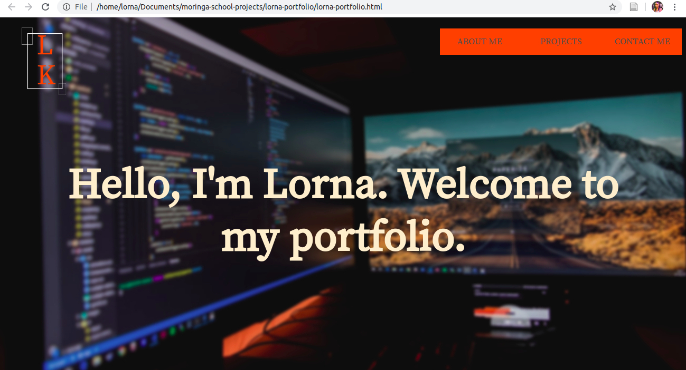
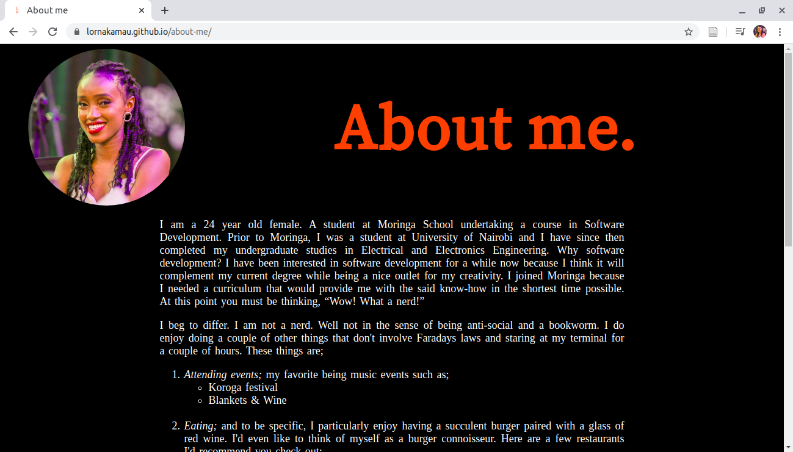
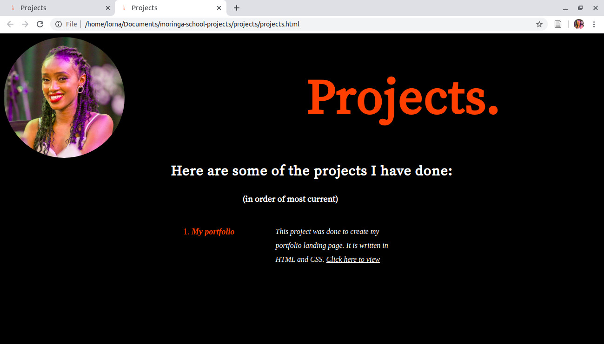
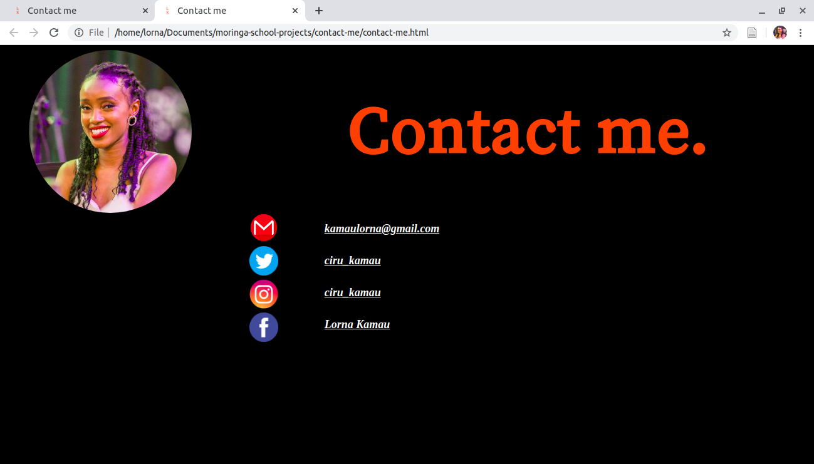

# My Portfolio
#### An online portfolio for Lorna Kamau, 16th March 2020
#### By **Lorna Kamau**
## Description
This is an online portfolio for Lorna Kamau. This webpage provides visitors with insight into who Lorna Kamau is; her interests, hobbies, skills, educational and professional background and most importantly access to projects she's done.
The webpage's landing page has three buttons on the topright as shown below;

Each tab opens up to another webpage. Here's what each page looks like;

## Setup/Installation Requirements
To view My Portfolio, do the following;
1. Check that your internet connection is active.
2. Click on this link https://lornakamau.github.io/lorna-portfolio/. Doing so will redirect you to my portfolio's landing page.
## Technologies Used
This project is written in HTML and CSS.
## Support and contact details
Should you be unable to access my portfolio, have any recommendations or questions, feel free to email me; kamaulorna@gmail.com.
### License
*MIT
Copyright (c) 2020 **Lorna Kamau**